Hi there, thanks for stopping by! I'm **Alfredo Chavez**.

If you want to know more about me, try parsing the following object 😉:

```js
const alfredoChavez = {
  name: 'Alfredo Chávez',
  location: 'London, UK',
  roles: [
    'Software Developer',
    'Computational Designer',
    'Architect (ARB Registered)',
  ],
  about: `
    Full-stack and 3D developer with a background in architecture,
    computational design, and digital fabrication. I blend parametric thinking,
    immersive 3D experiences, and scalable software to create innovative tools
    for design, visualization, and the web.
  `,
  languages: ['JavaScript', 'TypeScript', 'Python', 'C#', 'HTML', 'CSS'],
  tools: {
    frontEnd: ['React', 'Three.js', 'R3F', 'TailwindCSS', 'Angular'],
    backEnd: ['Node.js', 'Express', 'Koa'],
    databases: ['MongoDB', 'SQL'],
    testing: ['Jest', 'Mocha', 'Vitest', 'Playwright'],
    computationalDesign: [
      'Rhinoceros',
      'Grasshopper',
      'Unity3D',
      'Unreal Engine',
      'Digital Fabrication',
    ],
  },
  funFact:
    'Can jump between Grasshopper definitions and full-stack apps 👨‍💻 without breaking a sweat.',
};
```

You can reach out to me here 🌍:

https://www.linkedin.com/in/alfredo-chavez/

<br>

<div align="center">
  
  
</div>

<br>

<div align="center">
  
  
</div>

<!--
**AlfredoChavez/AlfredoChavez** is a ✨ _special_ ✨ repository because its `README.md` (this file) appears on your GitHub profile.
